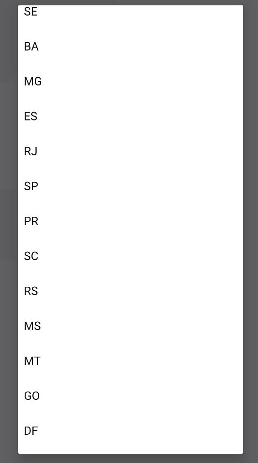

# Projeto_NextLevelWeek_Ecoleta

Projeto da semana next level da rocketseat 2020.

#### Telas web

 

#### Telas mobile

    

  

## Projeto

##### Necessário

- Node js

**_Para fazer dowload de todo repositorio_**

> git clone --recurse-submodules https://github.com/guilhermegoa/Projeto_NextLevelWeek_Ecoleta.git

### Server

- Entrar na pasta Ecoleta_server
- Para conseguir executar na sua maquina é necessario mudar a BASE_URL no arquico .env. Para isso deve pegar o ip da sua maquina, no terminal:

  > ipconfig

- Copie o Ipv4 e troque conforme conforme o exemplo:

  > Susbstitua na BASE_URL no arquivo .env
  > http://{Ipv4}:3333  
  > Ex: http://192.168.1.1:3333

- Com o terminal aberto execute os comandos

  > yarn install

  > yarn knex:migrate

  > yarn knex:seed

- Para iniciar o server

  > yarn start

**_Pronto, agora é so rodar o projeto web ou mobile._**

### Web

- No terminal na pasta Ecoleta_web, cole esses comandos

  > yarn install

- Para iniciar o projeto web

  > yarn start

### Mobile

- Para rodar o mobile é necessário instalar o expo cli, com o comando:

  > yarn global add expo-cli

- Agora, abra na pasta do mobile e vá até pasta src/services/api.ts e mude a BASE_URL.
  Exemplo:

  > http://{Ipv4}:3333  
  > Ex: http://192.168.1.1:3333

- Após isso, no terminal na pasta mobile e rode os comandos:

  > yarn install

  > yarn start

- Apos abrir a pagina do expo na web selecione LAN pra rodar o app em seu celular
- Abra o App no celular e escaneie o QRCode
