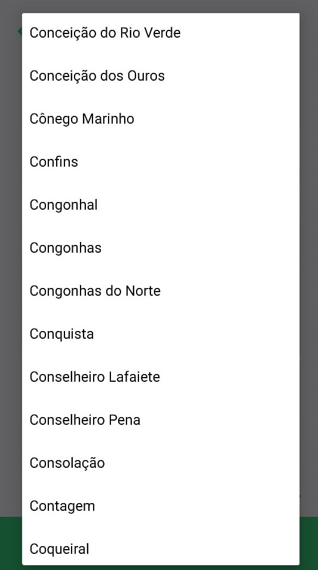

# Projeto_NextLevelWeek_Ecoleta

Rocketseat 2020 next_level_week_1 project.

#### Web screens

 

#### Mobile screens

    

  

## Project

##### Required

- Install [Node js](https://nodejs.org/en/)
- Install [yarn](https://classic.yarnpkg.com/en/docs/install/#windows-stable)
- Expo app, if running a mobile project

**_To download the entire repository_**

> git clone --recurse-submodules https://github.com/guilhermegoa/Projeto_NextLevelWeek_Ecoleta.git

### Server

- Open the Ecoleta_server folder
- To be open, you need to access the src folder, change the BASE_URL in the ".env" file. For that you must get the machine's ip, in the terminal:

  > ipconfig

  

- Copy the Ipv4 an change in the .env file as shown:

  > Susbstitua na BASE_URL no arquivo .env
  > http://{Ipv4}:3333  
  > Ex: http://192.168.1.103:3333

* With the terminal open, execute the commands:

  > yarn install

  > yarn knex:migrate

  > yarn knex:seed

* To start the server

  > yarn dev

**_Ok, now just run the web or mobile project._**

### Web

- In the terminal open folder Ecoleta_web and run command

  > yarn install

- To start the project web

  > yarn start

### Mobile

- To run the mobile it necessary install the expo-cli, with command:

  > yarn global add expo-cli

- Now, open mobile folder. Go to src/services, open api.ts file and change the BASE_URL.

  > http://{Ipv4}:3333  
  > Ex: http://192.168.1.1:3333

- After that, in the terminal open the mobile folder and run commands:

  > yarn install

  > yarn start

- After opening the expo's web page select LAN in the CONNECTION section to the run app in phone.
  

- Open the expo app in phone and scan QRCode.
